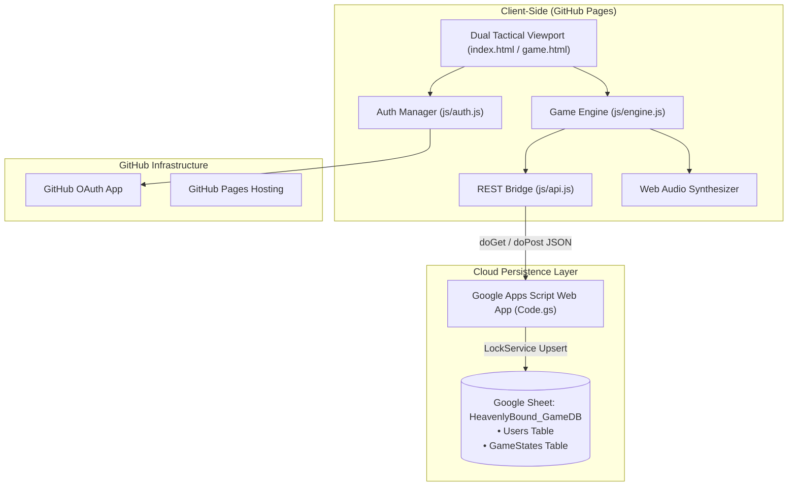

# HeavenlyBound — Operation: Severed Grid

A serverless hybrid cyber-celestial tactical game blending **Command & Conquer** base building (*The Sanctum / Outie Grid*) with **D&D 5e-style d20 procedural dungeon incursions** (*The Ascent / Innie Run*) and a **Severed Memory / Divine Grace degradation loop**, hosted on **GitHub Pages** with **GitHub OAuth** authentication and **Google Sheets / Google Apps Script** cloud persistence.


---

## 🏛️ System Architecture

Because static pages hosted on GitHub Pages cannot securely store backend database connections or secret keys directly, **HeavenlyBound** uses a **Serverless/Client-Side Hybrid Model**:



1. **Frontend Hosting**: GitHub Pages (Vanilla HTML5 / CSS3 / JavaScript with HTML5 Canvas and Web Audio API).
2. **Authentication**: GitHub OAuth App with instant offline Guest / Pilgrim Simulation fallback.
3. **Database & Persistence**: Google Sheets (`HeavenlyBound_GameDB`) accessed via Google Apps Script Web App REST API (`doGet` / `doPost`), with local storage buffering.

---

## 🎮 Core Gameplay Loops

### 1. The "Outie" Sanctum Grid (Command & Conquer Style)
- Manage your celestial base on an interactive $10 \times 6$ canvas grid.
- Construct economic and tactical structures:
  - **Sol Foundry**: Generates $+6$ Tithe Credits per tick.
  - **Aether Well**: Harvests $+3$ Aether Shards per tick.
  - **Grace Anchor**: Reduces incursion memory degradation by $30\%$.
  - **Ascended Chamber**: Adds $+2$ bonus to all Operative D&D dice rolls.
  - **Heavenly Beacon**: Amplifies extraction loot shards by $+35\%$.

### 2. The "Innie" Ascent Run (D&D 5e-Style Tactical Crawler)
- Deploy your Operative into procedural $5 \times 5$ node dungeons.
- Face Corrupted Seraphs, Encrypted Relic Vaults, Void Firewalls, and Restoration Shrines.
- Interactive $d20 + \text{Mod}$ skill checks:
  - **Prowess (STR)** & **Reflex (DEX)**: Combat breach and evasive strikes.
  - **Logic (INT)** & **Perception (WIS)**: Relic decryption and trap scouting.
  - **Resilience (CON)** & **Grace (CHA)**: Void barrier mitigation and daemon pacification.
  - **Critical Glory (Nat 20)**: Double loot rewards.
  - **Critical Fumble (Nat 1)**: Severe damage and accelerated memory loss.

### 3. The "Severed Grace" Degradation Twist
- Synaptic Memory / Grace Integrity decays per move and action during the run.
- As Grace drops below $50\%$ and $25\%$, CRT glitch distortions activate and skill check penalties apply.
- Reach the **Extraction Gate** to bank all harvested Shards safely into Sanctum storage before total severance amnesia wipes your operative.

---

## 📁 Project Structure

```
/
├── index.html                  # Main dashboard, operative dossier & login portal
├── game.html                   # Core game interface (Dual Outie + Innie viewports)
├── css/
│   └── styles.css              # Cyber-celestial / Lumon dark aesthetic styling
├── js/
│   ├── auth.js                 # GitHub OAuth & Guest Pilgrim session manager
│   ├── api.js                  # Google Apps Script REST API bridge & local buffer
│   ├── engine.js               # C&C base builder + D&D procedural engine + Audio Synth
│   └── ui.js                   # Canvas renderer & HUD event coordinator
├── google-apps-script/
│   └── Code.gs                 # Google Apps Script backend for HeavenlyBound_GameDB
├── SETUP.md                    # Detailed deployment & configuration walkthrough
└── README.md                   # Project documentation
```

---

## 🚀 Quick Start & Deployment

1. **Deploy to GitHub Pages**:
   - Push repository to GitHub.
   - Go to **Settings > Pages > Branch: `main` > Save**.
2. **Setup Backend**:
   - Follow the detailed steps in [SETUP.md](SETUP.md) to create your Google Sheet and deploy `Code.gs`.
3. **Configure Settings**:
   - Open `index.html`, click **⚙️ SYSTEM CONFIG**, enter your GitHub Client ID and Apps Script URL, then click **Save Config**.
