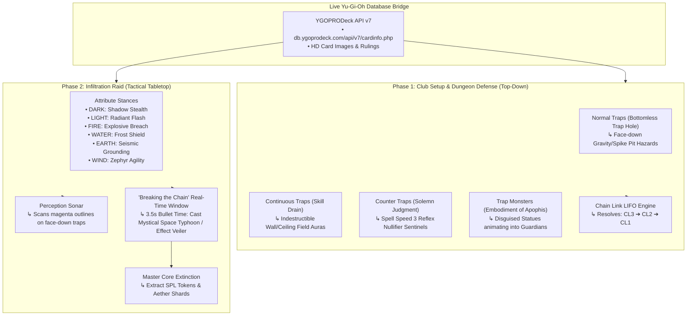

# HeavenlyBound — Yu-Gi-Oh Dungeon Defense vs Infiltration (Beta)

A serverless tactical game mapping **Yu-Gi-Oh's database primitives** directly into a **Top-Down Dungeon Defense vs. Mobile Tabletop Infiltration Raid** hybrid, powered by live **YGOPRODeck API v7** card data, **GitHub Pages** hosting, **GitHub OAuth** authentication, and **Google Sheets / Google Apps Script** cloud persistence.


---

## 🏛️ Yu-Gi-Oh Primitive Architecture



---

## 🎮 Core Game Modes

### Phase 1: Dungeon Defense (Top-Down Tabletop Architect)
- **Normal Traps** (*Bottomless Trap Hole*, *Compulsory Evacuation Device*): Placed face-down on grid tiles. Stepping on the pressure plate triggers high physical damage and knockback.
- **Continuous Traps** (*Skill Drain*, *Imperial Order*): Placed as glowing runes. Emits a permanent room aura (silencing dash and active abilities) until destroyed.
- **Counter Traps** (*Solemn Judgment*, *Dark Bribe*): Placed at bottlenecks at **Spell Speed 3**. Automatically negates the intruder's first movement ability upon room entry.
- **Trap Monsters** (*Embodiment of Apophis*, *Conquistador*): Disguised statues that animate into armed elite guardians when room locks are breached.
- **Chain Link Logic (LIFO Resolution Engine)**: Multiple traps placed in a room sequence form a chain (CL1 $\to$ CL2 $\to$ CL3) and resolve in **Reverse Order** (CL3 $\to$ CL2 $\to$ CL1)!

### Phase 2: Infiltration Raid (Tactical Tabletop Action-Crawler)
- **Mobile & Touch Optimized**: Clean touch targets ($\ge 44\text{px}$), swipeable layouts, and responsive stance wheels designed for phones and desktop dashboards.
- **Attribute Stances**:
  - `DARK` (Shadow Stealth): Invisible to automated turret sensors.
  - `LIGHT` (Radiant Flash): Blinds cameras and stuns gargoyles.
  - `FIRE` (Explosive Breach): Melts door locks and deals $+75\%$ damage to the Master Core.
  - `WATER` (Frost Shield): Chills thermal sensors and absorbs $50\%$ hazard damage.
  - `EARTH` (Seismic Grounding): Immune to knockback and gravity collapse pits.
  - `WIND` (Zephyr Agility): Speed boost and trap evasion.
- **Perception Sonar**: High Perception highlights face-down Normal Traps with a glowing **magenta wireframe** outline!
- **"Breaking the Chain" Bullet-Time Window**: When a trap chain is triggered, enter a 3.5-second countdown to play a Quick-Play Spell (*Mystical Space Typhoon*) or Hand-Trap (*Effect Veiler*) to negate and break the chain!
- **Master Core Extinction**: Reach the Master Core Room, destroy the core, and harvest enemy **SPL Token Resources** and Aether Shards.

---

## 📁 Project Structure

```
/
├── index.html                  # Main dashboard, operative briefing & login portal
├── game.html                   # Core tabletop dashboard (Defense, Infiltration, Card Vault)
├── css/
│   └── styles.css              # Cyber-matrix styling, Yu-Gi-Oh card frames, mobile responsive
├── js/
│   ├── auth.js                 # GitHub OAuth & Guest Pilgrim session manager
│   ├── api.js                  # Google Apps Script REST API bridge & local buffer
│   ├── ygo-api.js              # Live YGOPRODeck API v7 client & card rules mapper
│   ├── engine.js               # Top-down defense, Chain Link LIFO engine, Infiltration loop
│   └── ui.js                   # Mobile-first dashboard UI, Chain Link visualizer, Stance selector
├── google-apps-script/
│   └── Code.gs                 # Google Apps Script backend for HeavenlyBound_GameDB
├── SETUP.md                    # Deployment and configuration guide
└── README.md                   # Project documentation
```

---

## 🚀 Quick Start & Deployment

1. **Host on GitHub Pages**:
   - Push repository to GitHub.
   - Go to **Settings > Pages > Branch: `main` > Save**.
2. **Setup Backend**:
   - Follow [SETUP.md](SETUP.md) to initialize your Google Sheet and deploy `Code.gs`.
3. **Play Instantly**:
   - Open `index.html`, tap **⚡ Instant Pilgrim Launch**, and tap **🚀 ENTER THE TACTICAL GRID** to launch into `game.html`!
