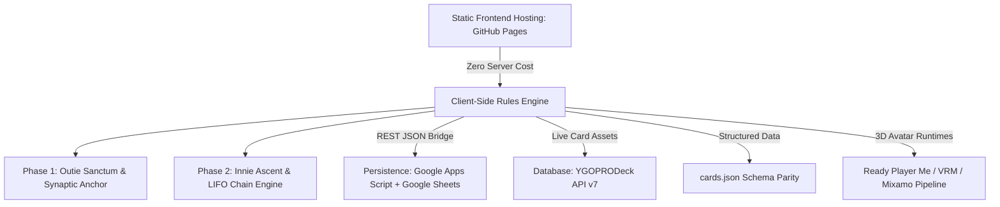

# Seraphim Unbound — Operation: Severed Grid
**Live Static Deployment:** [tritonsama.github.io](https://tritonsama.github.io/) | **Local Dev:** `http://localhost:8000/`

A serverless tactical web application blending **Command & Conquer** base operations, **D&D 5e-style d20 procedural incursions**, and **Yu-Gi-Oh LIFO Chain Link tactical mechanics**, hosted for free on **GitHub Pages** and backed by **Google Sheets** via **Google Apps Script**.


---

## 📚 Complete Project Documentation Suite

The complete suite of professional business, engineering, and operational documentation is organized in the [`docs/`](docs/) directory:

### 1. 💼 Business-Oriented Documents
- **[Problem Definition Canvas (PDC)](docs/business/PROBLEM_DEFINITION_CANVAS.md):** Clarifies problem statement, stakeholders, user pain points, value proposition, and KPIs.
- **[Software Requirements Specification (SRS)](docs/business/SOFTWARE_REQUIREMENTS_SPECIFICATION.md):** Detailed functional requirements (FR), non-functional requirements (NFR), and system context diagrams.
- **[Project Initiation Document (PID)](docs/business/PROJECT_INITIATION_DOCUMENT.md):** Defines project scope, deliverables, zero-cost budget model, milestones, and risk assessment.

### 2. 🛠️ Engineering Documents
- **[Software Design Document (SDD)](docs/engineering/SOFTWARE_DESIGN_DOCUMENT.md):** Technical blueprint, component decomposition, sequence diagrams, and schema definitions.
- **[3D Avatar Pipeline Specification](docs/engineering/3D_AVATAR_PIPELINE.md):** Free 3D avatar tools and integration pipeline across Ready Player Me, VRoid Studio (VRM), Adobe Mixamo, and MakeHuman.
- **[API Documentation](docs/engineering/API_DOCUMENTATION.md):** Complete specifications for Google Apps Script Web App REST endpoints and YGOPRODeck API v7 queries.
- **[Test Plan & Test Cases](docs/engineering/TEST_PLAN_AND_CASES.md):** Verification matrix, test procedures, LIFO stack tests, and automated validation scripts.
- **[Code Documentation](docs/engineering/CODE_DOCUMENTATION.md):** In-depth code walkthrough of `script.js`, `cards.json`, `style.css`, and `Code.gs`.

### 3. 📖 Supplementary & Operational Documents
- **[User Guide & Operative Manual](docs/operations/USER_GUIDE.md):** Onboarding guide, Synaptic Anchor setup, Rules Engine toggles, and troubleshooting tips.
- **[Release Notes](docs/operations/RELEASE_NOTES.md):** Version changelogs across v1.0.0, v2.0.0, and v2.4.0.
- **[Architecture Decision Records (ADRs)](docs/operations/ADR/):**
  - [ADR-001: Serverless/Client-Side Hybrid Model](docs/operations/ADR/ADR-001-serverless-hybrid-architecture.md)
  - [ADR-002: LIFO Chain Link Resolution Engine](docs/operations/ADR/ADR-002-lifo-chain-link-engine.md)
  - [ADR-003: Card Asset Serialization & YGOPRODeck Bridge](docs/operations/ADR/ADR-003-card-serialization-and-ygo-api.md)
  - [ADR-004: Hidden Background Synaptic Anchor Process](docs/operations/ADR/ADR-004-client-side-zodiac-anchor.md)
  - [ADR-005: 3D Avatar Creation Tools & Cross-Platform Pipeline](docs/operations/ADR/ADR-005-3d-avatar-pipeline.md)

---

## ⚡ Core Architecture



---

## 🚀 Quick Setup & Deployment

1. **Deploy to GitHub Pages:** Push the repository to GitHub and enable Pages from the `main` branch.
2. **Deploy Apps Script Backend:**
   - Create a Google Sheet with a tab named `Pilgrims` (`player_id`, `zodiac_sign`, `action_type`, `result`, `timestamp`).
   - Open **Extensions > Apps Script**, paste [`google-apps-script/Code.gs`](google-apps-script/Code.gs), and deploy as a Web App accessible by "Anyone".
   - Copy the Web App URL into `script.js` (`const APPS_SCRIPT_URL`).
3. **Run Locally:**
   ```bash
   python -m http.server 8000
   ```
   Open [http://localhost:8000/](http://localhost:8000/) in your browser.
