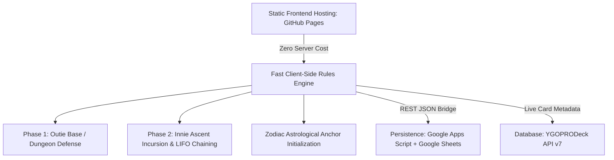

# Problem Definition Canvas: Seraphim Unbound / HeavenlyBound
**Project Moniker:** Operation: Severed Grid  
**Document Version:** 1.0.0 | **Date:** August 2026 | **Status:** Approved

---

## 1. Problem Statement

Modern browser-based tactical games suffer from two major deficiencies:
1. **Shallow Gameplay Mechanics:** Most lightweight web games lack deep mechanical synergy, failing to capture the strategic depth of tabletop card chaining (e.g., Yu-Gi-Oh's Spell Speed / Chain Link systems) combined with tactical base defense and procedural dungeon crawling.
2. **Infrastructure Cost & Operational Friction:** Traditional client-server multiplayer and persistent web games require expensive dedicated servers, complex authentication gateways, and continuous maintenance, creating high barriers to entry for indie studios and web3/open-source communities.

**Core Question:** How can we deliver an engaging, mechanically sophisticated, cross-platform tactical incursion and dungeon defense game with zero server hosting costs, verifiable state persistence, and seamless mobile/desktop access?

---

## 2. Key Stakeholders & Users

| Stakeholder Group | Persona / Profile | Primary Needs & Motivations |
| :--- | :--- | :--- |
| **Tactical Gamers & TCG Enthusiasts** | Competitive players who enjoy Yu-Gi-Oh, D&D 5e, and Command & Conquer. | Deep reactive gameplay, LIFO chain combos, fast counterplay, high-stakes dungeon incursion loops. |
| **Mobile & Web Players** | Casual/Mid-core players accessing via mobile browsers or Chromebooks. | Zero installation, fast load times (<2s), intuitive touch interface, offline-resilient progress. |
| **Dungeon Architects / Club Leaders** | Strategic guild leaders building base territories. | Rich customization of trap layouts, modular environmental auras, defense synergy, territory control. |
| **Developers & Studio Engineers** | Open-source contributors scaling to Flutter/Unity. | Clean schema serialization (`cards.json`), modular rules engines, extensible API bridges. |

---

## 3. User Pain Points

- **High Barrier to Entry:** Forced app store downloads, multi-gigabyte client installs, and mandatory complex account registration.
- **Latency & Desync in Fast-Paced Card Play:** Rigid turn structures that do not support real-time reaction windows or spell speed hierarchies.
- **Data Loss on Web Games:** Fragile local storage that gets erased when clearing browser cookies or switching devices.
- **Lack of Cross-Genre Innovation:** Base building and dungeon crawling remain completely siloed from card chaining and dice-driven RPG encounters.

---

## 4. Proposed Solution & Value Proposition

**Seraphim Unbound ("HeavenlyBound")** solves these pain points through a **Serverless/Client-Side Hybrid Architecture**:

- **Dual Severed Loop:** "Outie" Sanctum base building directly fuels "Innie" dungeon incursion stats; incursion shards must be extracted before memory decay wipes operative integrity.
- **Proprietary LIFO Chain Engine:** Directly adapts Yu-Gi-Oh's Chain Link logic (CL1 $\to$ CL2 $\to$ CL3 resolving in reverse: CL3 $\to$ CL2 $\to$ CL1) into physical room traps and reaction hand-cards.
- **Zero-Cost Production Stack:** 100% free hosting on GitHub Pages with Google Sheets acting as a secure relational data store via Google Apps Script Web Apps.
- **Universal Schema Parity:** Structured `cards.json` serialization guarantees seamless migration to Flutter and Unity engines in subsequent development phases.

---

## 5. Alternative Solutions Evaluated

| Architecture / Stack | Pros | Cons | Reason for Rejection / Selection |
| :--- | :--- | :--- | :--- |
| **Dedicated Node.js / PostgreSQL on AWS** | High control, WebSockets. | High monthly infrastructure costs, complex DevOps. | **Rejected:** Violates zero-cost serverless mandate. |
| **Pure Client-Side LocalStorage Only** | Instant setup, zero backend. | No multi-device sync, easily erased by browser cache clears. | **Rejected:** Lacks persistent global leaderboard and club territory sync. |
| **GitHub Pages + Google Sheets via Apps Script (Selected)** | 100% free, version-controlled, zero server ops, built-in spreadsheet GUI. | Apps Script execution quotas (6 min/exec), slight CORS redirect nuances. | **Selected:** Optimal balance of zero hosting cost, relational data persistence, and rapid deployment. |

---

## 6. Success Metrics (KPIs)

1. **Client Performance:** Initial page load under 1.5 seconds on 4G mobile networks; zero external heavyweight framework dependencies.
2. **LIFO Chain Execution Accuracy:** 100% compliance with Last-In, First-Out trap chain resolution across simulated encounters.
3. **Data Sync Reliability:** $>99.5\%$ successful payload commitments to Google Sheets with automatic offline local buffering fallback.
4. **Mobile Usability:** 100% interactive touch target compliance ($\ge 44\text{px}$) across all viewports.
