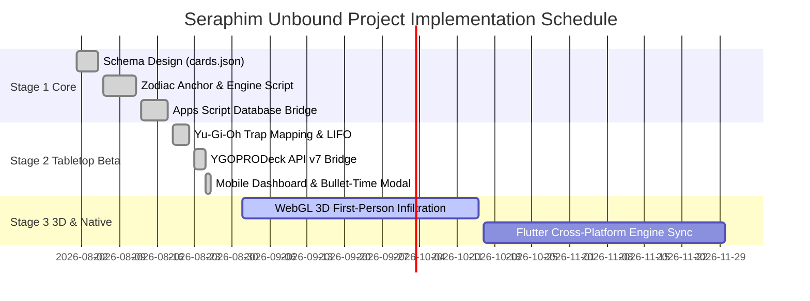

# Project Initiation Document (PID)
**Project Title:** Seraphim Unbound / HeavenlyBound  
**Project Sponsor:** Advanced Agentic Architecture Initiative | **Date:** August 2026 | **Version:** 1.0.0

---

## 1. Project Charter & Scope

### 1.1 Project Objective
The primary objective of the **Seraphim Unbound** project is to design, deploy, and scale a zero-infrastructure-cost tactical hybrid web game that demonstrates:
1. Browser-based tabletop defense and dungeon incursion loops.
2. Proprietary event-driven rules execution utilizing Yu-Gi-Oh's LIFO Chain Link mechanics.
3. Automated relational persistence directly into Google Sheets via serverless Google Apps Script endpoints.
4. Structured card/gear serialization ready for cross-platform expansion (Web $\to$ Flutter $\to$ Unity).

### 1.2 In-Scope Deliverables
- **Stage 1 Tactical Core (`index.html`, `style.css`, `script.js`, `cards.json`):**
  - Operative authentication & Zodiac Astrological Anchor computation.
  - Rules Engine with configurable event toggles (`AUTO`, `ON`, `OFF`).
  - LIFO Chain Link stack manager and simulated incursion action (`VAULT_BREACH`).
  - Pre-serialized card dataset (`cards.json`) supporting modular trigger/reaction payloads.
  - Deployed Google Apps Script `Code.gs` logging player sessions and incursion actions into `Pilgrims` sheet.
- **Stage 2 Extended Tactical Arena (`game.html`, `js/engine.js`, `js/ygo-api.js`, `js/ui.js`):**
  - Top-down tabletop defense architect with tile placement.
  - Mobile-first infiltration action-crawler with 6 attribute stances.
  - Live YGOPRODeck API v7 integration for live card searching and CDN artwork.
- **Stage 3 Native Cross-Platform Evolution (Future Roadmap):**
  - WebGL / 3D FPS Infiltration engine and Flutter mobile wrapper utilizing the unified `cards.json` schema.

### 1.3 Out-of-Scope (Stage 1 & 2)
- Real-time peer-to-peer WebRTC multiplayer (handled via asynchronous territory conquest and leaderboards).
- Centralized SQL server infrastructure requiring paid server hosting.

---

## 2. Resource Allocation & Budget

| Resource Category | Specification / Provider | Allocated Monthly Cost |
| :--- | :--- | :--- |
| **Frontend Web Hosting** | GitHub Pages (Static CDN) | **\$0.00 / month** (Free tier) |
| **Database & Persistence** | Google Sheets (`HeavenlyBound_GameDB`) | **\$0.00 / month** (Free tier) |
| **API & Backend Engine** | Google Apps Script (Web App REST) | **\$0.00 / month** (Free tier, 20k exec/day) |
| **Card Assets & Metadata** | YGOPRODeck REST API v7 + CDN | **\$0.00 / month** (Public open API) |
| **Total Operational Cost** | **Serverless Zero-Cost Model** | **\$0.00 / month** |

---

## 3. Project Milestones & Schedule

---

## 4. Risk Assessment & Mitigation Plan

| Risk Identifier | Risk Description | Severity | Probability | Mitigation Strategy |
| :--- | :--- | :---: | :---: | :--- |
| **RSK-001** | Google Apps Script execution timeout (6-minute ceiling) or lock contention. | Medium | Low | Use `LockService.tryLock(15000)` with immediate graceful JSON responses; keep payloads lightweight. |
| **RSK-002** | External YGOPRODeck API latency or rate limiting. | Medium | Medium | Implement local memory caching (`Map`) and pre-cached canonical starter cards in `YgoApi`. |
| **RSK-003** | Browser cookie / storage clears wiping un-synced player progress. | High | Medium | Prompt user to sync frequently; backup state to Google Sheets on key incursion milestones. |
| **RSK-004** | Schema drift when porting `cards.json` to Flutter/Unity. | High | Low | Enforce strict TypeScript/JSON validation for all card properties (`grammar_role`, `activation_cost`). |
