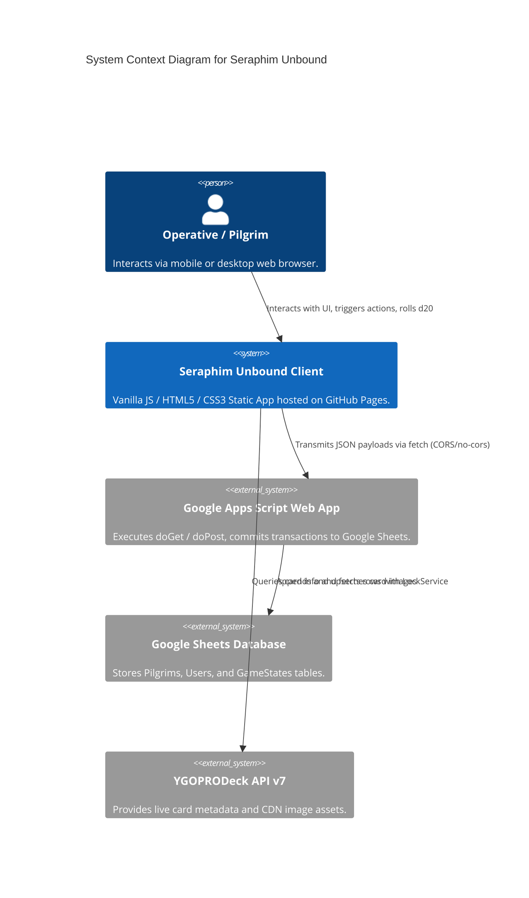

# Software Requirements Specification (SRS)
**Project Title:** Seraphim Unbound / HeavenlyBound: Operation Severed Grid  
**Document Identifier:** SRS-SERAPHIM-001 | **Version:** 2.4 | **Date:** August 2026

---

## 1. Introduction

### 1.1 Purpose
This Software Requirements Specification (SRS) establishes the formal functional, non-functional, and technical requirements for **Seraphim Unbound** (branded as **HeavenlyBound**). It serves as the baseline for developers, QA testers, and architectural stakeholders across web, mobile, and future native engine implementations.

### 1.2 Scope of the System
The system is a static-hosted, serverless hybrid web game blending:
- **Outie Sanctum Base Operations:** Resource management and passive modifier generation.
- **Innie Ascent Incursions:** Event-driven procedural dungeon incursions with d20 skill checks and memory degradation.
- **Yu-Gi-Oh Tactical Chain Link Engine:** Real-time LIFO resolution for traps, quick-play spells, and hand-traps.
- **Cloud Persistence Bridge:** REST synchronization into Google Sheets via Google Apps Script.

---

## 2. Overall Description

### 2.1 System Context & Architecture
The application runs as a single-page application (SPA) deployed to GitHub Pages. It integrates with external data services:
1. **Google Apps Script Web App Endpoint:** Relational persistence for player identities (`Pilgrims`), game states (`GameStates`), and user profiles (`Users`).
2. **YGOPRODeck REST API v7:** Live retrieval of card artwork, types, spell speeds, and descriptions.



---

## 3. Functional Requirements

### 3.1 Operative Authentication & Astrological Anchor
- **FR-AUTH-001 (Handle & Birthday Input):** The system shall prompt the user for an operative handle (`player-id`) and date of birth (`player-birthday`).
- **FR-AUTH-002 (Zodiac Computation):** The system shall compute the user's Western Zodiac sign using calendar day/month thresholds and display the result in the Outie Sanctum.
- **FR-AUTH-003 (Pilgrim Registration):** Upon initial grid link generation, the client shall transmit `{ player_id, zodiac, action: 'initialize' }` to the Apps Script bridge.

### 3.2 Rules Engine & Event Hook System
- **FR-ENG-001 (Toggle Mode Cycling):** The rules engine shall support three operational modes: `AUTO`, `ON`, and `OFF`.
- **FR-ENG-002 (Event Hook Evaluation):**
  - When `toggleState === 'ON'`, all event triggers (`ATTACK_INCOMING`, `VAULT_BREACH`) shall open an interactive Chain Link.
  - When `toggleState === 'AUTO'`, the engine shall evaluate `isLogicalWindow(eventType)` and open Chain Links only for critical logical encounters.
  - When `toggleState === 'OFF'`, optional prompts are bypassed and logged to the terminal.
- **FR-ENG-003 (Tactical Vault Breach):** The user can simulate an incursion action executing a randomized $d20 + 3$ modifier calculation, emitting a `VAULT_BREACH` event.

### 3.3 Yu-Gi-Oh Trap Classification & Chain Link LIFO Engine
- **FR-TRAP-001 (Normal Traps):** Single-trigger floor tile hazards triggering damage, knockback, or trap status upon intrusion.
- **FR-TRAP-002 (Continuous Traps):** Environmental room runes radiating permanent auras (silencing abilities/dash) until physically destroyed.
- **FR-TRAP-003 (Counter Traps):** Spell Speed 3 sentinel mechanisms automatically negating the intruder's initial action.
- **FR-TRAP-004 (Trap Monsters):** Disguised statues that animate into armed garrison guardians when sector locks are breached.
- **FR-CHAIN-001 (LIFO Stack Resolution):** When multiple traps or reaction cards are chained ($CL1 \to CL2 \to \dots \to CL_n$), resolution shall strictly execute in reverse order ($CL_n \to \dots \to CL2 \to CL1$).
- **FR-CHAIN-002 (Reaction Window):** The system shall provide a real-time 3.5-second bullet-time countdown allowing operatives to cast Quick-Play Spells or Hand-Traps to break active chains.

### 3.4 Data Serialization & Cross-Platform Parity
- **FR-DATA-001 (`cards.json` Schema):** All game assets shall be pre-serialized in valid JSON adhering to:
  ```json
  {
    "id": "string",
    "name": "string",
    "type": "string",
    "grammar_role": "trigger | reaction | action | continuous",
    "activation_cost": { "energy": "number" },
    "targeting_vector": "string",
    "resolution_payload": "string"
  }
  ```

---

## 4. Non-Functional Requirements (NFRs)

### 4.1 Performance & Latency
- **NFR-PERF-001:** Initial page bundle size shall not exceed $150\text{ KB}$ uncompressed (excluding external CDN images).
- **NFR-PERF-002:** Client-side d20 dice rolls and LIFO chain resolution execution time shall remain $<16\text{ ms}$ (maintaining 60 FPS).

### 4.2 Usability & Responsiveness
- **NFR-UI-001:** Touch targets across all mobile views shall adhere to a minimum interactive dimension of $44\text{px} \times 44\text{px}$.
- **NFR-UI-002:** UI layout shall adapt seamlessly across viewports from $360\text{px}$ (mobile) up to $2560\text{px}$ (4K desktop).

### 4.3 Reliability & Offline Resilience
- **NFR-REL-001:** In the event of network failure or unconfigured Apps Script endpoints, the client shall buffer transactions locally without crashing or blocking user gameplay.

### 4.4 Security & Data Privacy
- **NFR-SEC-001:** No sensitive API secret keys or write tokens shall be stored in public client-side JavaScript.
- **NFR-SEC-002:** The Google Apps Script endpoint shall sanitize input strings before appending rows into Google Sheets.
