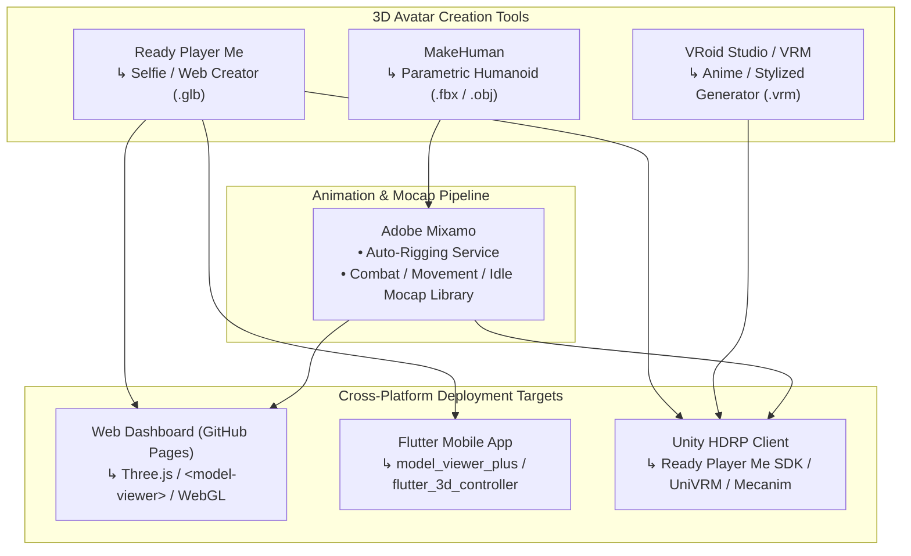

# 3D Avatar Creation Tools & Cross-Platform Pipeline Specification
**Project:** Seraphim Unbound / HeavenlyBound | **Version:** 1.0.0 | **Date:** August 2026

---

## 1. Overview & Architectural Goals

As **Seraphim Unbound** scales from its static **Stage 1 Tactical Core** on GitHub Pages into **Flutter mobile clients** and **Unity HDRP desktop environments**, player avatars must transition from 2D profile badges into fully rigged, animated **3D Operative Models**.

This specification defines the integration pipeline for the four primary open/free 3D avatar tools:
1. **Ready Player Me (`.glb` / glTF)**
2. **VRM Consortium / VRoid Studio (`.vrm`)**
3. **Adobe Mixamo (Mocap Rigging & Animations)**
4. **MakeHuman (Parametric Open-Source Rigging)**



---

## 2. Tool Breakdown & Technical Comparison

| Tool / Standard | Primary Format | Export Cost | Rigging Type | Best Used For | Runtime Compatibility |
| :--- | :---: | :---: | :---: | :--- | :--- |
| **Ready Player Me** | `.glb` (glTF 2.0) | **Free** | Standard Humanoid (mixamorig) | Instant web customizer, selfie-to-avatar, rapid web/mobile onboarding. | Web (Three.js), Flutter, Unity, Unreal |
| **VRoid Studio / VRM** | `.vrm` (glTF extension) | **Free (FOSS)** | Humanoid + Spring Bones (Hair/Cloth physics) | Anime / stylized seraphim characters, custom texture painting. | Unity (UniVRM), Web (three-vrm), Godot |
| **Adobe Mixamo** | `.fbx` (Binary) | **Free** | Skeletal Auto-Rigger + 2,000+ Mocap Clips | Animating custom `.fbx`/`.obj` meshes for combat, dodge rolls, and idle stances. | Unity (Mecanim), Blender, Unreal, Three.js |
| **MakeHuman** | `.fbx` / `.obj` / `.dae` | **Free (Open Source)** | Customizable Rigify / Game Engine skeleton | Realistic/parametric anatomical proportions, open-source asset generation. | Blender, Unity, Unreal |

---

## 3. Runtime Integration Pipeline

### 3.1 Web Dashboard (GitHub Pages / Three.js)
On static web clients, avatars are rendered using Google's `<model-viewer>` or lightweight Three.js glTF loaders:

```html
<!-- Embedded 3D Avatar Viewer in Outie Sanctum -->
<script type="module" src="https://ajax.googleapis.com/ajax/libs/model-viewer/3.4.0/model-viewer.min.js"></script>

<model-viewer 
    id="operative-3d-avatar"
    src="https://models.readyplayer.me/64b5f5c40000000000000000.glb" 
    alt="Operative 3D Avatar"
    auto-rotate 
    camera-controls
    interaction-prompt="none"
    style="width: 100%; height: 280px; background-color: #050a14; border: 1px solid #3b82f6;">
</model-viewer>
```

---

### 3.2 Flutter Mobile Application (`model_viewer_plus`)
In cross-platform Flutter applications, the same `.glb` URL is rendered with zero re-exporting:

```dart
import 'package:flutter/material.dart';
import 'package:model_viewer_plus/model_viewer_plus.dart';

Widget buildOperativeAvatar(String avatarGlbUrl) {
  return ModelViewer(
    src: avatarGlbUrl,
    alt: "Operative 3D Avatar",
    ar: false,
    autoRotate: true,
    cameraControls: true,
    backgroundColor: const Color(0xFF0F172A),
  );
}
```

---

### 3.3 Unity HDRP High-End Client
In Unity HDRP (High Definition Render Pipeline):
1. **Ready Player Me SDK:** Import the `Ready Player Me Core` Unity package. Load avatars via runtime URL:
   ```csharp
   using ReadyPlayerMe.Core;
   
   public class AvatarLoaderManager : MonoBehaviour {
       public void LoadAvatar(string avatarUrl) {
           var loader = new GameObject("AvatarLoader").AddComponent<AvatarObjectLoader>();
           loader.LoadAvatar(avatarUrl);
       }
   }
   ```
2. **UniVRM SDK:** For VRoid `.vrm` seraph characters, drag `.vrm` files into the project assets; UniVRM automatically sets up the Humanoid Avatar rig, blend shapes, and spring-bone cloth physics.
3. **Mixamo Animations:** Retarget Mixamo combat mocap clips (`VaultBreach.fbx`, `DodgeRoll.fbx`, `SpellCast.fbx`) directly to the humanoid animator controller.

---

## 4. Card-to-Gear 3D Serialization Schema

To allow tactical cards (`cards.json`) to equip visual 3D gear onto avatars, the schema is extended with visual asset references:

```json
{
  "id": "CARD_001",
  "name": "Cryo-Armor Directive",
  "type": "Trap/Tool",
  "grammar_role": "trigger",
  "activation_cost": { "energy": 50 },
  "targeting_vector": "self",
  "resolution_payload": "Grant +20% kinetic resistance and deploy sub-zero barrier.",
  "visual_asset_3d": {
    "slot": "torso_armor",
    "mesh_prefab": "Assets/Gear/CryoArmor_Torso.glb",
    "shader_material": "SubZero_IceGlow_HDRP",
    "particle_fx": "FX_CryoBarrier_Emit"
  }
}
```
