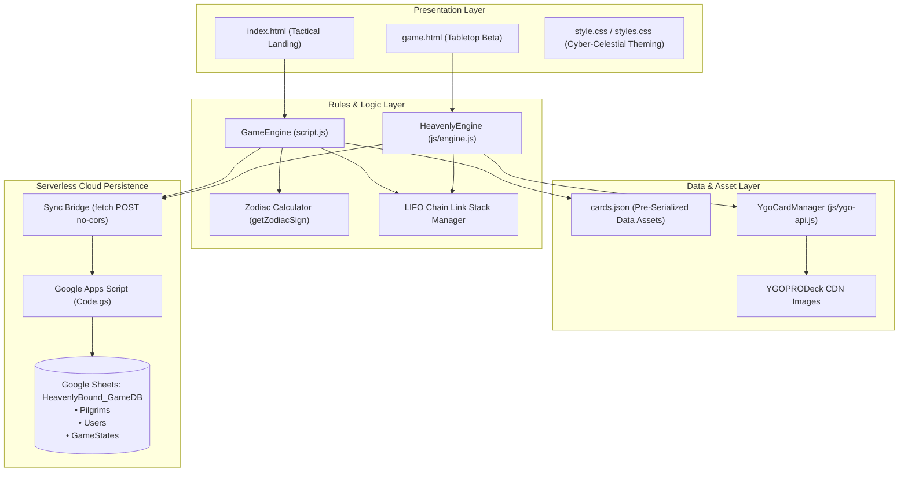
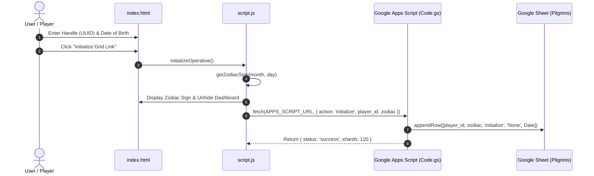
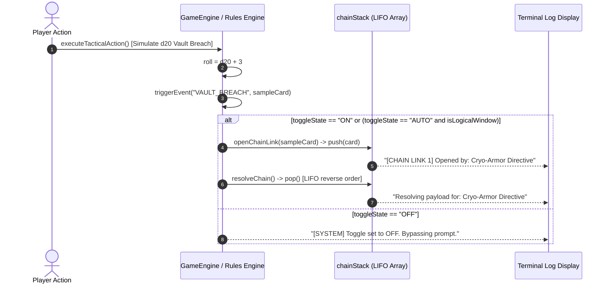

# Software Design Document (SDD)
**Project Title:** Seraphim Unbound / HeavenlyBound: Tactical Architecture  
**Document Identifier:** SDD-SERAPHIM-002 | **Version:** 2.4 | **Date:** August 2026

---

## 1. Architectural Blueprint & Component Decomposition

The system is decomposed into four modular layers:
1. **Presentation Layer (DOM & CSS Engine):**
   - Stage 1: `index.html` + `style.css` (Terminal Interface & Zodiac Dashboard).
   - Stage 2: `game.html` + `css/styles.css` (Tabletop Grid, Stance Wheel, Bullet-Time Modal).
2. **Rules & Chaining Layer (`script.js` / `js/engine.js`):**
   - LIFO Stack Manager (`chainStack`, `openChainLink`, `resolveChain`).
   - Event Hook Evaluator (`triggerEvent`, `isLogicalWindow`).
   - Astrological Anchor Calculator (`getZodiacSign`).
3. **External Data Bridge Layer (`js/ygo-api.js` & `cards.json`):**
   - Structured card asset parser adhering to JSON schemas.
   - REST bridge to `https://db.ygoprodeck.com/api/v7/cardinfo.php`.
4. **Cloud Persistence Bridge (`google-apps-script/Code.gs` & `js/api.js`):**
   - Asynchronous HTTP POST payload transmitter to Google Apps Script.



---

## 2. Sequence Diagrams

### 2.1 Operative Authentication & Zodiac Calculation



### 2.2 Tactical Event Trigger & LIFO Chain Link Resolution



---

## 3. Data Models & Schemas

### 3.1 `cards.json` Asset Schema
```json
{
  "$schema": "http://json-schema.org/draft-07/schema#",
  "type": "object",
  "properties": {
    "id": { "type": "string" },
    "name": { "type": "string" },
    "type": { "type": "string" },
    "grammar_role": { "type": "string", "enum": ["trigger", "reaction", "action", "continuous"] },
    "activation_cost": {
      "type": "object",
      "properties": { "energy": { "type": "number" } },
      "required": ["energy"]
    },
    "targeting_vector": { "type": "string" },
    "resolution_payload": { "type": "string" }
  },
  "required": ["id", "name", "type", "grammar_role", "activation_cost", "targeting_vector", "resolution_payload"]
}
```

### 3.2 Google Sheets `Pilgrims` Table Schema
| Column Index | Field Name | Data Type | Description |
| :---: | :--- | :--- | :--- |
| **A** | `player_id` | `String` | Unique operative handle / UUID. |
| **B** | `zodiac_sign` | `String` | Computed astrological anchor (e.g. "Aries", "Scorpio"). |
| **C** | `action_type` | `String` | Action trigger (e.g. "initialize", "vault_breach"). |
| **D** | `result` | `String` | Card payload name or numeric d20 check result. |
| **E** | `timestamp` | `ISO 8601 Date` | Exact server commitment timestamp. |
