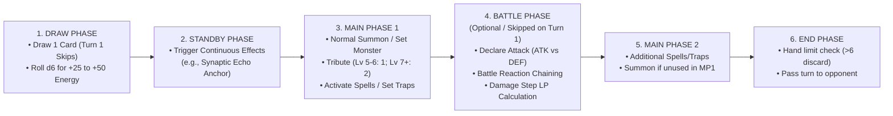

# User Guide & Operative Manual: Seraphim Unbound
**Game Title:** Seraphim Unbound / HeavenlyBound | **Version:** 2.6 (Official 6-Phase TCG Duel Engine)

---

## 1. Quick Start Guide

### Step 1: Accessing the Grid
Open your web browser on mobile or desktop and navigate to:
```text
https://tritonsama.github.io/
```
*(Or `http://localhost:8000/` for local testing).*

---

### Step 2: Operative Authentication & Synaptic Anchor
1. Enter your **Operative Handle** (e.g. `ALPHA-7`) and select your **Clearance Timestamp**.
2. Click **Initialize Grid Link**.
3. The system silently calibrates your **Synaptic Anchor** in the background and unlocks the 6-Phase Tactical Duel Arena.

---

## 2. ⚔️ Official 6-Phase Tactical TCG Duel Rules

### Deck & Resource Setup
- **Deck Size:** Each player is equipped with a randomized deck of **10+ Cards** drawn from Monsters (Levels 1–8), Spells (Normal, Quick-Play, Equip, Continuous), and Traps (Normal, Continuous, Counter Speed 3, Hand-Traps).
- **Life Points (LP):** Both operatives start with **4000 LP**.
- **Hand Size:** Players start with 4 cards (Maximum hand size limit: 6 cards).

---

### The 6-Phase Turn Machine



#### 1. Draw Phase
- Draw 1 card from your Deck.
- *First Turn Rule:* The player who goes first (Turn 1) does **not** draw on their very first turn.
- **Resource Dice Roll:** Rolls a $d6$ die to generate random Shards/Energy/Mana ($20 + \text{Roll} \times 5 \implies +25 \text{ to } +50 \text{ Energy}$).

#### 2. Standby Phase
- Resolve any continuous card effects or maintenance costs (e.g., *Synaptic Echo Anchor* restores +300 LP and +20 Energy).

#### 3. Main Phase 1 (MP1)
- **Normal Summon / Set Monsters:** 
  - Level 1–4: Free (0 Tributes).
  - Level 5–6: Requires 1 Tribute from your field monsters.
  - Level 7–8: Requires 2 Tributes from your field monsters.
- **Activate Spell Cards:** Normal Spells, Equip Spells (*United We Stand*), Continuous Spells.
- **Set Trap Cards:** Place face-down in the Spell/Trap Zone.

#### 4. Battle Phase (BP) *(Optional — Skipped on Turn 1)*
- Declare attacks with Attack Position monsters.
- **Battle Step & Fast Effects:** Opponent can activate reactive Traps (*Mirror Force*, *Cryo-Armor Directive*, *Solemn Sentinel Barrier*) or Hand-Traps (*Effect Veiler Pulse*) forming a Chain Link!
- **Damage Step Calculation:**
  - *ATK vs ATK:* Lower ATK monster destroyed; loser takes difference in battle damage to LP.
  - *ATK vs DEF:* If ATK > DEF, defense monster destroyed (no LP damage). If ATK < DEF, attacker takes difference to LP.
  - *Direct Attack:* If defender has no monsters on field, deals full monster ATK directly to opponent's LP!

#### 5. Main Phase 2 (MP2)
- Activate additional Spells, Set more Traps, or Normal Summon if unused during MP1.

#### 6. End Phase (EP)
- Resolve end-of-turn effects.
- **Hand Limit Check:** Discard excess cards to the Graveyard if your hand exceeds 6 cards.
- Turn passes to your opponent $\to$ Opponent initiates their Draw Phase.

---

### Fast Effects & LIFO Chain Links
Any time a card effect or attack is declared, the opponent may respond with a Fast Effect / Quick-Play Spell / Trap. Chains form ($CL1 \to CL2 \to CL3$) and resolve in **Reverse Order** ($CL3 \to CL2 \to CL1$).
